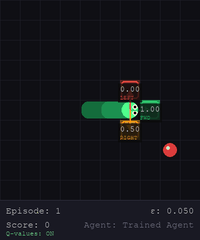
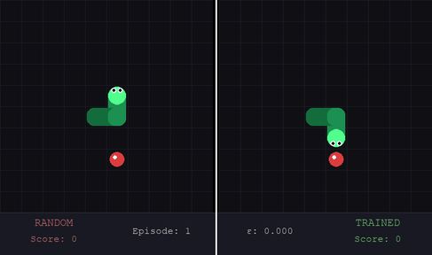
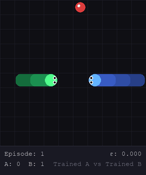

<div align="center">

# 🐍 Snake RL — Q-Learning to DQN

**A fully interpretable reinforcement learning project built from scratch in Python.**  
Tabular Q-Learning · Double Q-Learning · DQN · Multi-Agent · Live Q-Value Overlay · Human vs AI


</div>

---

## Demos

<div align="center">



*Single agent with live Q-value overlay — green = best action, amber = middle, red = worst.*

</div>

<div align="center">



*Random vs trained agent on identical food sequences — the performance gap is immediate.*

</div>

<div align="center">



*Two trained agents competing on a shared board with simultaneous moves.*

</div>

---

## Headline Results

| Metric | Value |
|---|---|
| Mean score vs random baseline | **56× better** |
| Episodes scoring ≥ 5 | **92%** |
| Episodes scoring ≥ 10 | **60%** |
| Max score achieved | **25** |
| DQN vs Double Q eval mean | **11.42 vs 11.21** (5× fewer episodes) |
| Win rate vs random (multi-agent) | **86.52%** |
| Win rate vs self-play opponent | **~40%** (genuinely competitive) |
| Final state space explored | **1,017 unique states** |
| Test suite | **42/42 passing** |

---

## What This Project Demonstrates

- **Tabular Q-Learning converges but plateaus** — the binary state abstraction is the binding constraint, not training time
- **Double Q-Learning reduces variance** — +29% mean score improvement with no architectural change
- **Tail awareness is the decisive feature** — adding 4 tail-direction bits produced a +378% mean score jump
- **DQN matches tabular in 5× fewer episodes** — function approximation generalises across unvisited states; the ceiling is shared because both use the same 12-bit state
- **Self-play ≠ domination** — a trained agent wins 86% against random but only ~40% against a self-play opponent, exposing random-baseline win rate as a poor quality measure
- **Tabular RL is fully interpretable** — every Q-value can be read, every decision visualised

---

## Project Structure

```
Snake-RL/
├── snake_rl/                   # Core package
│   ├── env.py                  # SnakeEnv — single-agent game environment
│   ├── agent.py                # TabularQAgent + DoubleQAgent
│   ├── train.py                # Single-agent training loop
│   ├── dqn_agent.py            # QNetwork, ReplayBuffer, DQNAgent
│   ├── dqn_train.py            # DQN training loop
│   ├── multi_env.py            # MultiSnakeEnv — two-snake competitive env
│   ├── multi_train.py          # Multi-agent training (vs random + self-play)
│   └── renderer.py             # SnakeRenderer + MultiSnakeRenderer
├── scripts/
│   ├── run_training.py         # Train single agent (tabular)
│   ├── run_dqn_training.py     # Train DQN agent + evaluation + plots
│   ├── run_demo.py             # Watch trained agent (+ Q-value overlay)
│   ├── run_compare.py          # Statistical comparison vs random
│   ├── run_heatmap.py          # Policy heatmap (4 directions)
│   ├── run_sidebyside.py       # Random vs trained side-by-side
│   ├── run_human_vs_ai.py      # Human vs trained AI
│   ├── run_multi_training.py   # Multi-agent training
│   ├── run_multi_demo.py       # Multi-agent visual demo
│   ├── generate_report_plots.py # Report-ready academic figures
│   └── record_gif.py           # Capture gameplay as animated GIF
├── experiments/
│   ├── checkpoints/            # Saved models (.pkl tabular, .pth DQN)
│   └── plots/                  # Training and report plots (.png)
├── tests/
│   └── test_core.py            # 42 pytest tests — all passing
├── docs/
│   ├── architecture.md         # Full system architecture
│   ├── experiment_log.md       # All 10 experiment runs with results
│   └── phase_log.md            # Development decisions and rationale
├── assets/                     # GIFs and images for README
└── requirements.txt
```

---

## Quickstart

```bash
# 1. Clone and install
git clone https://github.com/Malik-Adeen/Snake-RL.git
cd Snake-RL
pip install -r requirements.txt

# 2. Train the agent (15,000 episodes, Double Q-Learning, 12-bit state)
python scripts/run_training.py --double --episodes 15000 --epsilon_decay 0.995 \
  --save_path experiments/checkpoints/q_table_double.pkl

# 3. Watch it play with live Q-value overlay
python scripts/run_demo.py --model experiments/checkpoints/q_table_double.pkl \
  --double --epsilon 0.05 --fps 5 --show_qvalues

# 4. Side-by-side: random vs trained
python scripts/run_sidebyside.py --double --fps 10 --episodes 5

# 5. Play against the AI yourself
python scripts/run_human_vs_ai.py --fps 8 --episodes 5

# 6. Statistical comparison (100 episodes)
python scripts/run_compare.py --double

# 7. Train DQN and compare (requires PyTorch)
python scripts/run_dqn_training.py --episodes 3000

# 8. Policy heatmap
python scripts/run_heatmap.py --double
```

---

## Controls

| Key | Action |
|---|---|
| `SPACE` | Pause / unpause |
| `↑` / `↓` | Speed up / slow down |
| `Q` | Quit |
| `Arrow keys` | Human vs AI — control your snake |
| `=` / `-` | Human vs AI — adjust speed |

---

## State Representation

The agent perceives the world through a **12-bit binary state vector**:

| Bits | Feature | Purpose |
|---|---|---|
| 0–2 | `danger_straight/left/right` | Immediate collision detection |
| 3–6 | `food_left/right/up/down` | Food direction |
| 7 | `food_close` | Manhattan distance ≤ 3 |
| 8–11 | `tail_left/right/up/down` | Escape route awareness |

Multi-agent adds 4 opponent bits (bits 12–15): `opp_left/right/up/down`.

---

## Experiment Progression

| Run | Agent | Bits | Episodes | States | Eval Mean | Max |
|---|---|---|---|---|---|---|
| 1 — Baseline | Standard Q | 7 | 2,000 | 64 | 1.74 | 11 |
| 2 — +Shaping | Standard Q | 7 | 2,000 | 64 | 2.16 | 15 |
| 4 — 8-bit | Standard Q | 8 | 5,000 | 128 | 1.81 | 15 |
| 5 — Double Q | Double Q | 8 | 5,000 | 128 | 2.34 | 14 |
| **6 — +Tail bits** | **Double Q** | **12** | **15,000** | **1,017** | **11.21** | **24** |
| 9 — Multi-seed | Double Q | 12 | 15,000×3 | 1,016±2 | 6.63±0.12 | 23±1 |
| **10 — DQN** | **DQN** | **12** | **3,000** | **N/A** | **11.42** | **25** |

Full details (all 10 runs) in [`docs/experiment_log.md`](docs/experiment_log.md).

---

## Algorithms

### Standard Q-Learning
```
target = reward + γ · max_a Q(s', a) · (1 − done)
Q(s, a) ← Q(s, a) + α · (target − Q(s, a))
```

### Double Q-Learning (primary agent)
```
a* = argmax_a Q_A(s', a)           # table A selects action
target = reward + γ · Q_B(s', a*)  # table B evaluates it
Q_A(s, a) ← Q_A(s, a) + α · (target − Q_A(s, a))
```
Decoupling selection from evaluation reduces overestimation bias and produces
a more consistent policy. +29% mean score improvement over standard Q.

### Deep Q-Network (comparison)
```
Q(s, a; θ) ≈ neural network (12 → 128 → 128 → 3)
target = reward + γ · max_a Q(s', a; θ⁻)   # θ⁻ = frozen target network
loss = MSE(Q(s, a; θ), target)
```
Same environment and 12-bit state as tabular. Reaches equivalent performance
(11.42 eval mean) in 3,000 episodes vs 15,000 for tabular — 5× more sample-efficient.

---

## Multi-Agent Results

Two agents compete on a shared 10×10 board with simultaneous moves and shared food.

**Trained vs Random** — 5,000 episodes:
- Agent A win rate: **86.52%** (converges to 95% in final episodes)
- Random agent max score across all episodes: **2**

**Self-Play** — 5,000 episodes:
- Neither agent exceeds 50% win rate — genuine competitive equilibrium
- Key insight: *win rate vs random badly overstates policy quality*

---

## Requirements

```
numpy>=1.26
matplotlib>=3.8
pygame>=2.6
pillow>=10.0
torch>=2.5      # for DQN only
```

---

## Documentation

| File | Contents |
|---|---|
| [`docs/architecture.md`](docs/architecture.md) | Full system design, state tables, training pipeline |
| [`docs/experiment_log.md`](docs/experiment_log.md) | All 10 runs with metrics, findings, and conclusions |
| [`docs/phase_log.md`](docs/phase_log.md) | Every design decision with rationale |

---

## References

1. Watkins, C.J.C.H. & Dayan, P. (1992). *Q-learning*. Machine Learning, 8, 279–292.
2. van Hasselt, H. (2010). *Double Q-learning*. Advances in Neural Information Processing Systems, 23.
3. Sutton, R.S. & Barto, A.G. (2018). *Reinforcement Learning: An Introduction* (2nd ed.). MIT Press.
4. Mnih, V. et al. (2015). *Human-level control through deep reinforcement learning*. Nature, 518, 529–533.

---

<div align="center">
Built as a university RL project — tabular methods, full interpretability, DQN comparison.
</div>
